# Flex 布局

## Flex布局的概念

1. flexble box：单行盒状布局

2. 容器控制内部元素的布局定位
3. CSS3引入的新布局模型

4. 伸缩元素，自由填充，自适应

## 使用Flex布局的优势

1. 可以在不同的方向排列元素
2. 控制元素`排列的方向`
3. 控制元素的`对齐方式`
4. 控制元素之间的`等距`
5. 控制单个元素放大与缩放比例、占比、对齐方式

## Flex布局的常用术语

1. `flex container`：flex容器

2. `flex item`：flex项目（元素）

3. `flex direction`：布局方向

## Flex布局的模型

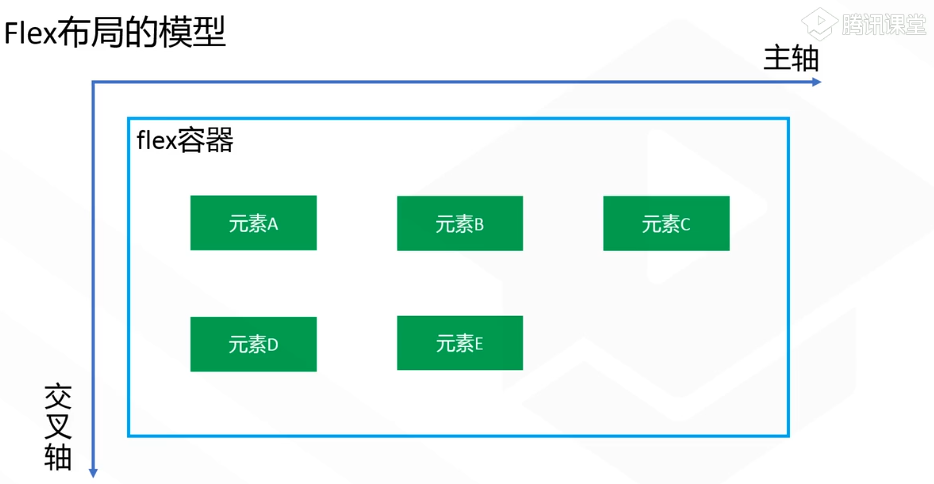

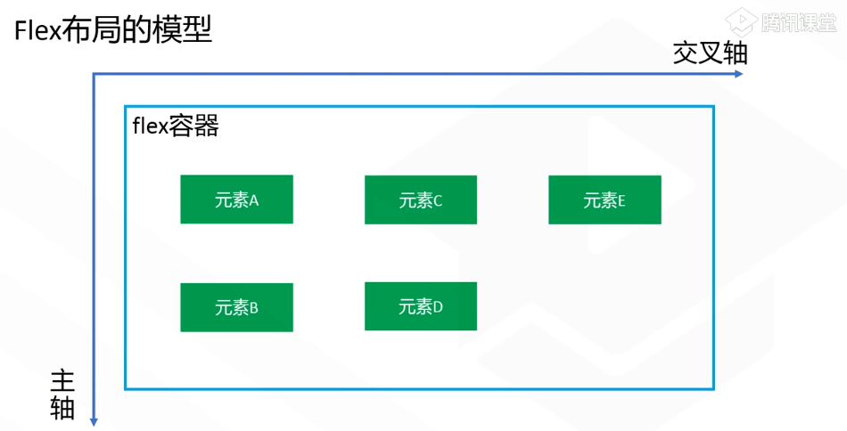

## Flex容器的属性

### 1. flex-direction：设置元素的排列方向

- `row`：从左向右

  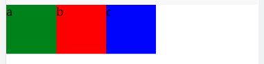

- `row-reverse`：从右向左（逆向）

  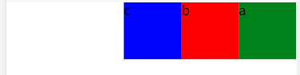

- `column`：从上到下（主轴方向垂直）

  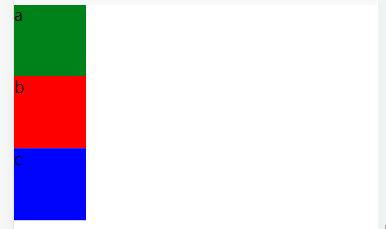

- `column-reverse`：从下到上（逆向）

  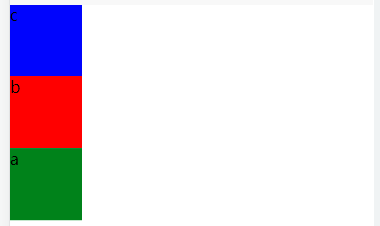

```css
.container {
    /* 定义flex容器 */
    display: flex;
    /*
    设置容器内部元素的排列方向
    row：定义排列方向 从左到右
    row-reverse：从右到左
    column：从上到下
    column-reverse：从下到上
    */
    flex-direction: column-reverse;
}
```

### 2.flex-wrap：使容器内的元素换行

- `noewrap`：不换行（会进行缩放）

  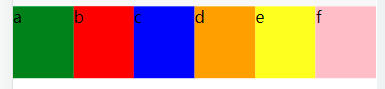

- `wrap`：换行

  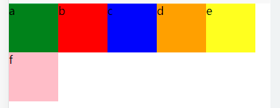

- `wrap-reverse`：逆向换行

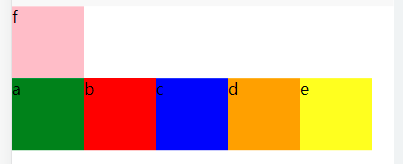

```css
/* 
 * nowrap: 不换行
 * wrap: 换行
 * wrap-reverse: 逆向换行
 */
flex-wrap: wrap-reverse;
```

### 3.justify-content：设置元素在主轴上的对齐方式

- `flex-start`：默认 左对齐（上对齐）

  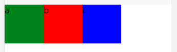

- `flex-end`：右对齐（下对齐）

  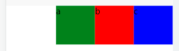

- `center`：居中对齐

  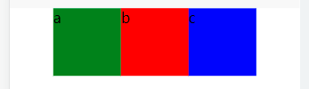

- `space-between`：两端对齐，空白均匀地填充在成员之间

  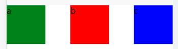

- `space-around`：元素两边平均等分剩余空白部分，最左或最右和元素之间的距离是`1:2`

  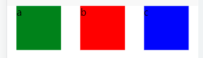
  
  ```css
  /* 
   * 设置元素在主轴上的对齐方式
   * flex-start: 默认 左对齐
   * flex-end: 右对齐
   * center: 居中对齐
   * space-between: 两端对齐，空白均匀地填充在成员之间
   * space-around: 元素两边平均等分剩余空白间隙部分，最左或最右和元素之间距离是1：2
   */
  justify-content: flex-end;
  ```
  
  

### 4.align-items：设置元素在交叉轴上的对齐方式

- `flex-start`：在交叉轴上向起点位置（向上/向左）对齐

  

- `flex-end`：在交叉轴上向终点位置（向下/向右）对齐

  

- `center`：居中对齐

  

- `baseline`：保证元素中的文字在同一条基准线（保证每个文字都在同一条线上）

  

- `stretch`（默认）：当元素的`高度没有设置`，则元素的高度会`拉伸`至与容器高度一致

  

```css
/* 
 * 设置容器中元素在交叉轴上的对齐方式
 * stretch: 默认当元素的高度没有设置，则元素的高度会拉伸至与容器高度一致
 * flex-start: 在交叉轴上向起点位置（向上/向左）对齐
 * center: 居中对齐
 */
align-items: baseline;
```

### 5.align-content：设置轴线的对齐方式（轴线当做元素）

- `flex-start`
- `flex-end`
- `center`
- `stretch`
- `space-between`
- `space-around`
