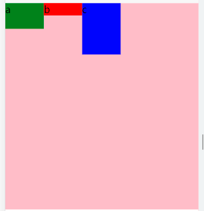
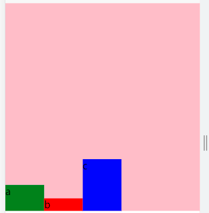

# Flex 布局

## Flex布局的概念

1. flexble box：单行盒状布局

2. 容器控制内部元素的布局定位
3. CSS3引入的新布局模型

4. 伸缩元素，自由填充，自适应

## 使用Flex布局的优势

1. 可以在不同的方向排列元素
2. 控制元素`排列的方向`
3. 控制元素的`对齐方式`
4. 控制元素之间的`等距`
5. 控制单个元素放大与缩放比例、占比、对齐方式

## Flex布局的常用术语

1. `flex container`：flex容器

2. `flex item`：flex项目（元素）

3. `flex direction`：布局方向

## Flex布局的模型


## Flex容器的属性

### 1. `flex-direction`：设置元素的排列方向

- `row`：从左向右

  

- `row-reverse`：从右向左（逆向）

  

- `column`：从上到下（主轴方向垂直）

  

- `column-reverse`：从下到上（逆向）

  

```css
.container {
    /* 定义flex容器 */
    display: flex;
    /*
    设置容器内部元素的排列方向
    row：定义排列方向 从左到右
    row-reverse：从右到左
    column：从上到下
    column-reverse：从下到上
    */
    flex-direction: column-reverse;
}
```

### 2.`flex-wrap`：使容器内的元素换行

- `noewrap`：不换行（会进行缩放）

  

- `wrap`：换行

  

- `wrap-reverse`：逆向换行


```css
/* 
 * nowrap: 不换行
 * wrap: 换行
 * wrap-reverse: 逆向换行
 */
flex-wrap: wrap-reverse;
```

### 3.`justify-content`：设置元素在主轴上的对齐方式

- `flex-start`：默认 左对齐（上对齐）

  

- `flex-end`：右对齐（下对齐）

  

- `center`：居中对齐

  

- `space-between`：两端对齐，空白均匀地填充在成员之间

  

- `space-around`：元素两边平均等分剩余空白部分，最左或最右和元素之间的距离是`1:2`

  
  
  ```css
  /* 
   * 设置元素在主轴上的对齐方式
   * flex-start: 默认 左对齐
   * flex-end: 右对齐
   * center: 居中对齐
   * space-between: 两端对齐，空白均匀地填充在成员之间
   * space-around: 元素两边平均等分剩余空白间隙部分，最左或最右和元素之间距离是1：2
   */
  justify-content: flex-end;
  ```
  
  

### 4.`align-items`：设置元素在交叉轴上的对齐方式

- `stretch`（默认）：当元素的`高度没有设置`，则元素的高度会`拉伸`至与容器高度一致


- `flex-start`：在交叉轴上向起点位置（向上/向左）对齐

  

- `flex-end`：在交叉轴上向终点位置（向下/向右）对齐

  

- `center`：居中对齐

  

- `baseline`：保证元素中的文字在同一条基准线（保证每个文字都在同一条线上）

  

```css
/* 
 * 设置容器中元素在交叉轴上的对齐方式
 * stretch: 默认当元素的高度没有设置，则元素的高度会拉伸至与容器高度一致
 * flex-start: 在交叉轴上向起点位置（向上/向左）对齐
 * flex-end: 在交叉轴上向起点位置（向下/向右）对齐
 * center: 居中对齐
 * baseline: 保证元素中的文字在同一条基准线（保证每个文字都在同一条线上）
 */
align-items: baseline;
```

### 5.`align-content`：设置轴线的对齐方式（轴线当做元素）

- `none`：默认 两条轴线分开分布，空白部分等分

  

- `flex-start`：向左对齐

  

- `flex-end`：向右对齐

  

- `center`：居中

  

- `stretch`：当宽度`width没有设置`的时候，轴线会被拉伸

  

- `space-between`：两端对齐，元素之间的空白等比切分

  

- `space-around`：轴线两边的空白等比切分 

  

```css
/* 
 * 当轴线超过一条的时候，flex容器可以把多条轴线视为元素对待，可以进行对齐
 * center: 居中
 * flex-start: 向左对齐
 * flex-end: 向右对齐
 * stretch: 当宽度width没有设置的时候，轴线可以被拉伸
 * space-between: 两端对齐，元素之间的空白等比切分
 * space-around: 轴线两边的空白等比切分 
 */
align-content: space-around;
```

## Flex元素的属性

### 1.`order`：控制元素的顺序

> order: 用于设置flex容器内部的每个元素的排列顺序，默认是**0**。排序规则`由小到大`

```css
.green {
	background-color: green;
	order: 0;
}

.red {
	background-color: red;
	order: 0;
}

.blue {
	background-color: blue;
	order: 0;
}
```


```css
.green {
	background-color: green;
	order: 3;
}

.red {
	background-color: red;
	order: 2;
}

.blue {
	background-color: blue;
	order: 1;
}
```


### 2.flex-grow：控制元素放大比例

> flex-gorw: 用于设置元素的放大比例，默认为 **0**。如果为0，则不放大

- flex-grow全部设置为 `0` 不放大

  ```css
  .green {
  	background-color: green;
  	flex-grow: 0;
  }
  
  .red {
  	background-color: red;
  	flex-grow: 0;
  }
  
  .blue {
  	background-color: blue;
  	flex-grow: 0;
  }
  ```


- flex-grow只有一个设置为1，则独占空白部分

  ```css
  .green {
  	background-color: green;
  	flex-grow: 0;
  }
  
  .red {
  	background-color: red;
  	flex-grow: 1; /* 独占空白部分 */
  }
  
  .blue {
  	background-color: blue;
  	flex-grow: 0;
  }
  ```


- flex-grow比例为`1:1:1`，各元素按照`1:1:1`的比例占用空白部分

  ```css
  .green {
  	background-color: green;
  	flex-grow: 1;
  }
  
  .red {
  	background-color: red;
  	flex-grow: 1;
  }
  
  .blue {
  	background-color: blue;
  	flex-grow: 1;
  }
  ```


- flex-grow比例为`1:2:1`，各元素按照`1:2:1`的比例占用空白部分

  ```css
  .green {
  	background-color: green;
  	flex-grow: 1;
  }
  
  .red {
  	background-color: red;
  	flex-grow: 2;
  }
  
  .blue {
  	background-color: blue;
  	flex-grow: 1;
  }
  ```

  

### 3.flex-shrink：控制元素缩小比例

> flex-shrink: 用于设置元素的缩小比例，默认为 1。如果为0，则不进行缩放

- flex-grow全部默认设置为 `1` ，进行缩小

  ```css
  .green {
  	background-color: green;
  	flex-shrink: 1;
  }
  
  .red {
  	background-color: red;
  	flex-shrink: 1;
  }
  
  .blue {
  	background-color: blue;
  	flex-shrink: 1;
  }
  ```

  

- flex-grow设置为0，则不进行缩小

  ```css
  .green {
  	background-color: green;
  	flex-shrink: 1;
  }
  
  .red {
  	background-color: red;
  	flex-shrink: 0;
  }
  
  .blue {
  	background-color: blue;
  	flex-shrink: 1;
  }
  ```

  

- flex-grow设置为0，则全部不缩小，多余部分被挤压出去

  ```
  .green {
  	background-color: green;
  	flex-shrink: 0;
  }
  
  .red {
  	background-color: red;
  	flex-shrink: 0;
  }
  
  .blue {
  	background-color: blue;
  	flex-shrink: 0;
  }
  ```


### 4.flex-basis：设置元素固定或自动空间的占比

> flex-basis: 用于设置元素的放大或缩小 

- 设置的像素比元素原有宽度大，会进行放大

  ```css
  .green {
  	background-color: green;
  }
  
  .red {
  	background-color: red;
  	flex-basis: 300upx;
  }
  
  .blue {
  	background-color: blue;
  }
  ```

  

- 设置的像素比元素原有宽度小，会进行缩小

  ```css
  .green {
  	background-color: green;
  }
  
  .red {
  	background-color: red;
  	flex-basis: 100upx;
  }
  
  .blue {
  	background-color: blue;
  }
  ```

  

### 5.align-self：重写justify-items父属性

- `auto`：默认，表示继承父级元素的属性

  

- `strach`：当元素的高度没有设置，则元素的高度会拉伸至与容器高度一致

  

- `flex-start`：向上对齐

  

- `flex-end`：向下对齐

  

- `center`：居中对齐

  

```css
/* 
 * 设置容器中元素在交叉轴上的对齐方式
 * auto: 默认
 * stretch: 当元素的高度没有设置，则元素的高度会拉伸至与容器高度一致
 * flex-start: 在交叉轴上向起点位置（向上/向左）对齐
 * flex-end: 在交叉轴上向起点位置（向下/向右）对齐
 * center: 居中对齐
 * baseline: 保证元素中的文字在同一条基准线（保证每个文字都在同一条线上）
 */
align-items: baseline;
```

